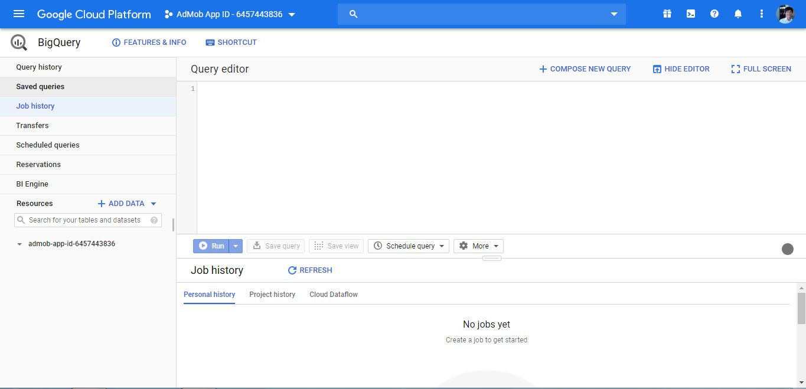

# TÀI LIỆU TÌM HIỂU MỘT SỐ CÔNG CỤ GOOGLE CLOUD PLATFORM

## BigQuery

### BigQuery là gì?

BigQuery là một công cụ kho phân tích dữ liệu của Google quản lý một cách đầy đủ, dễ mở rộng lên đến petabyte, chi phí thấp. BigQuery là một NoOps, một ý tưởng phân tích và quản lý dữ liệu tự động hóa hoàn toàn không cần đến đội ngũ quản trị dữ liệu - từ đó từ đó tập trung chủ yếu vào phân tích dữ liệu để tìm ra ý nghĩa sâu sắc của dữ liệu. BigQuery sử dụng cú pháp truy vấn tương tự SQL và được hưởng lợi ích của mô hình dùng bao nhiêu trả bấy nhiêu của Google.

[Tài liệu tổng hợp (tiếng Anh)](https://cloud.google.com/bigquery/docs)

### Các công cụ tiếp cận BigQuery

- Sử dụng giao diện trang web của Google (web UI)
- Sử dụng giao diện trang web của Google kiểu cũ (classic web UI)
- Sử dụng công cụ dòng lệnh
- Sử dụng các thư viện cho lập trình (hỗ trợ các ngôn ngữ: C#, Go, Java, Nodejs, PHP, Python, Ruby) *([Tài liệu tiếng Anh](https://cloud.google.com/bigquery/docs/quickstarts/quickstart-client-libraries))*

> Hướng tiếp cận so với hệ thống hiện tại là dùng ngôn ngữ C#
>
> *([Tài liệu tiếng Anh](https://googleapis.github.io/google-cloud-dotnet/docs/Google.Cloud.BigQuery.V2/))*

### Các tính năng của BigQuery (web UI) cung cấp

- Lịch sử truy vấn
- Lưu trữ các lệnh truy vấn
- Lịch sử các luồng công việc lặp lại (Job)
- Luồng dữ liệu (Transfers)
- Lập lịch truy vấn
- Đặt các giới hạn tinh gọn dữ liệu __*(có trả phí)*__
- Công cụ hỗ trợ ra quyết định dựa trên dữ liệu (BI Engine) __*(có trả phí)*__
- Các nguồn dữ liệu mà BigQuery có thể tương tác:
  - Dữ liệu công cộng của Google (Google public data)
  - Dịch vụ SQL của Google Cloud __*(có trả phí)*__
    - Cloud SQL - mySQL
    - Cloud SQL - PostgreSQL

*__Người tổng hợp: Nguyễn Hoàng Anh Khoa - VNDC__*